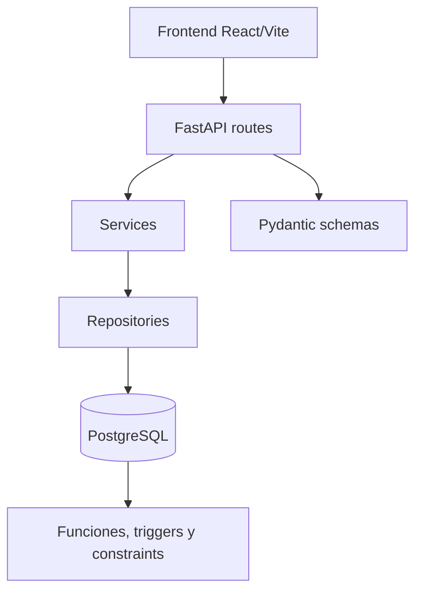
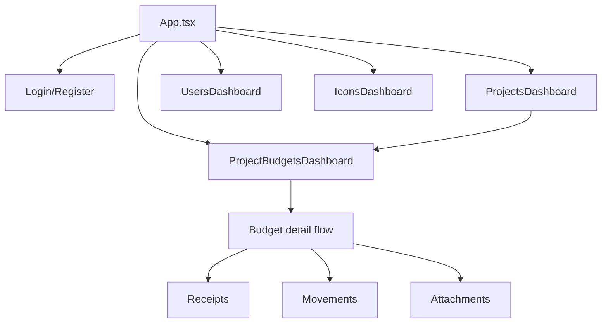
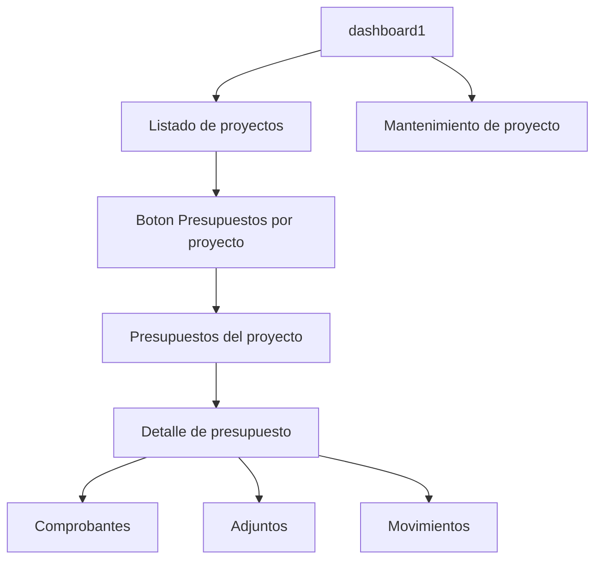

# UML Diagrams

## Backend layers



## Flujo de aprobacion de comprobante

```mermaid
flowchart TD
    A[POST /comprobantes/{id}/aprobar] --> B[Service de comprobantes]
    B --> C[Repository invoca aprobar_comprobante()]
    C --> D{Tipo de comprobante}
    D -->|FACTURA_FOTO o SINPE_MOVIL| E[Consumir saldo del presupuesto]
    D -->|CAJA_CHICA| F[Aumentar monto_total y saldo_disponible]
    E --> G[Insertar movimiento CONSUMO]
    F --> H[Insertar movimiento AUMENTO]
    G --> I[Comprobante APROBADO]
    H --> I
```

## Frontend actual



## Navegacion actual de proyectos y presupuestos


